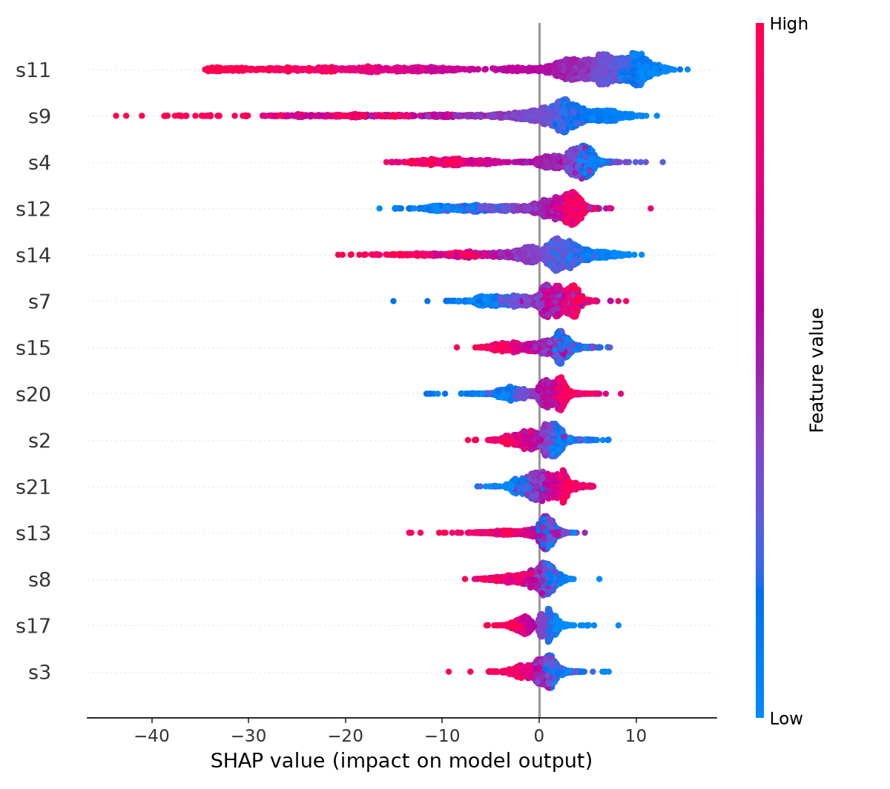

# Kestirimci Bakım: Turbofan Motor RUL Tahmini

Bu proje, turbofan motorlarının sensör verilerini kullanarak **Remaining Useful Life (RUL)** değerini, yani motorun arızalanmadan önce kaç çevrim daha çalışabileceğini tahmin etmeyi amaçlamaktadır.

Çalışmada NASA'nın **C-MAPSS FD001** veri seti kullanılmış ve farklı makine öğrenmesi ve derin öğrenme yaklaşımları karşılaştırılmıştır.

## Problem

Kestirimci bakımda amaç, bir ekipmanın ne zaman arızalanabileceğini önceden tahmin ederek bakım planlamasını mümkün hale getirmektir.

Bu projede problem şu şekilde ele alınmaktadır:

> **Motorun mevcut sensör ölçümlerine bakarak arızaya kaç çevrim kaldığını tahmin edebilir miyiz?**

Modelin çıktısı motorun tahmini RUL değeridir.

Örneğin:

```text
Tahmini RUL = 42 çevrim
```

model, motorun yaklaşık 42 çevrim sonra arızalanacağını tahmin etmektedir.

## Veri Seti

Projede **NASA C-MAPSS FD001** veri seti kullanılmıştır.

Veri setinde:

* 100 eğitim motoru
* 100 test motoru
* 21 sensör
* Birden fazla çalışma çevrimi
* Motorların arızaya kadar olan çalışma geçmişi

bulunmaktadır.

Veri ön işleme aşamasında sabit kalan sensörler ve operasyon ayarları çıkarılmış ve **14 sensör** kullanılmıştır.

RUL değerleri 125 çevrim ile sınırlandırılmıştır.

Eğitim ve test motorları veri setinde ayrı olarak bulunduğundan, eğitim ve test arasında motor bazlı veri sızıntısı bulunmamaktadır.

## Yaklaşım

Projede iki farklı makine öğrenmesi modeli ve bir derin öğrenme modeli karşılaştırılmıştır.

### 1. Random Forest

İlk baseline model olarak Random Forest kullanılmıştır.

Her çevrime ait sensör ölçümleri modele girdi olarak verilerek RUL tahmini yapılmıştır.

### 2. XGBoost

İkinci baseline model olarak XGBoost kullanılmıştır.

XGBoost, sensörler arasındaki doğrusal olmayan ilişkileri modellemek amacıyla kullanılmıştır.

### 3. LSTM

Motor sensörleri zaman içerisinde değiştiği için, geçmiş çevrimlerdeki bilgiyi kullanabilen bir **LSTM** modeli geliştirilmiştir.

Modelde:

* 14 sensör
* 30 çevrimlik zaman penceresi
* 2 LSTM katmanı

kullanılmıştır.

Böylece model yalnızca motorun mevcut durumunu değil, son 30 çevrimdeki değişimini de dikkate almaktadır.

## Veri İşleme

Özellikler `MinMaxScaler` kullanılarak ölçeklendirilmiştir.

Scaler yalnızca eğitim verisine fit edilmiş, daha sonra aynı dönüşüm test verisine uygulanmıştır.

LSTM için sensör verileri 30 çevrimlik zaman pencerelerine dönüştürülmüştür.

Test aşamasında her motorun son çevriminden oluşturulan pencere kullanılarak motorun kalan ömrü tahmin edilmiştir.

## Sonuçlar

Modellerin test setindeki sonuçları:

| Model         | Test RMSE | NASA Skoru |
| ------------- | --------: | ---------: |
| Random Forest |     17.18 |      917.2 |
| XGBoost       |     16.71 |      808.4 |
| **LSTM**      | **13.11** |  **275.5** |

Her iki metrikte de düşük değer daha iyidir.

Bu deneyde LSTM modeli, kullanılan baseline modellere kıyasla daha düşük RMSE ve NASA skoru elde etmiştir.

> LSTM sonuçları son epoch'a aittir. Bu çalışmada en iyi epoch seçimi yapılmamıştır.

## Model Yorumlanabilirliği

Modelin sensörler üzerindeki davranışını incelemek amacıyla XGBoost modeli üzerinde **SHAP** analizi uygulanmıştır.

SHAP analizinde en etkili sensörler:

* `s11`
* `s9`
* `s4`
* `s12`
* `s14`

olarak bulunmuştur.

SHAP çıktısı:



Bu analiz, modelin RUL tahmininde hangi sensörlerden daha fazla yararlandığını incelemeye yardımcı olmaktadır.

## Projenin Kapsamı

Bu çalışma, RUL tahmini problemini üç farklı model yaklaşımı üzerinden inceleyen bir deneysel projedir.

Temel akış:

```text
NASA C-MAPSS FD001
        ↓
   Veri temizleme
        ↓
   Sensör seçimi
        ↓
     Ölçekleme
        ↓
 ┌──────┼──────┐
 ↓      ↓      ↓
RF   XGBoost  LSTM
 └──────┼──────┘
        ↓
   RUL Tahmini
        ↓
 RMSE / NASA Skoru
        ↓
   SHAP Analizi
```

## Sınırlılıklar

Çalışma yalnızca **FD001** veri seti üzerinde gerçekleştirilmiştir. Bu nedenle farklı çalışma koşulları ve farklı arıza türleri için sonuçların aynı şekilde geçerli olacağı garanti edilemez.

Ayrıca hiperparametre optimizasyonu yapılmamış ve deneylerde tek bir random seed kullanılmıştır. LSTM için en iyi epoch seçimi de gerçekleştirilmemiştir.

SHAP analizi yalnızca XGBoost modeli için uygulanmıştır.

## Çalıştırma

Gerekli paketleri yükleyin:

```bash
pip install -r requirements.txt
```

NASA C-MAPSS FD001 verilerini:

```text
data/raw/
```

klasörüne yerleştirin.

Baseline modelleri çalıştırmak için:

```bash
python src/train_baseline.py
```

LSTM modelini çalıştırmak için:

```bash
python src/train_lstm.py
```

SHAP analizini çalıştırmak için:

```bash
python src/explain.py
```
